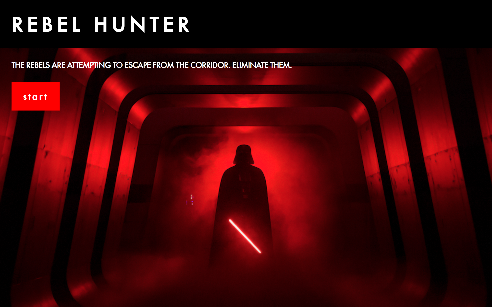

# Rebel Hunter

## What is Rebel Hunter?

> Rebel Hunter is a single player, 1D side scroller where users play as Darth Vader to eliminate rebel forces as they try to escape before their energy/depletes to 0. The game is not designed to have a clear win-lose scenario. It is more of a rhythm/survival game. 

1 = BLOCK. SPACEBAR = ATTACK.
1 defends against blaster bolts.
Spacebar eliminates rebels.
A user can block incoming blaster bolts and kill enemy agents in order to rack up points, whilst trying to last as long as possible.

## Technical Discussion

> This project uses a structured approach to design with HTML and CSS. Also, it uses JS/jQuery for DOM manipulation, constructors, random spawn and time intervals of agents, arrow functions to simplify syntax, for/if-else statements to describe collision logic, and to reset the game world upon user death, among other functions. 

### Notes on Game Structure

> The first approach I used was to test how the game would look. This was done early in the design process with a quickly written HTML/CSS syntax and minor JS dom manipulation. After getting approval from the group leader, I started to fully work on the structure of the game by essentially dividing the game into 3 states - "start" -> "gameplay" -> "end", which also helped immensely for CSS styling and spawning the game pieces in a maneagable way. The most time consuming aspect of the game was researching a good way to approach game-making, facing questions such as "what is considered enjoyable", "how do you create a lifelike approach to movements", "how do you reward a player for sticking it through", and "how can you tell a story", to name a few. This resulted in creating constructors that spawned the rebel and blaster bolt agents via a constructor and calling them at game start, to create a sense of "overwhelming odds" for the player. I played with the spawn rates and gameplay speeds/hitboxes to get a good balance between "Okay, I can breeze through this" and "I can be easily overwhelmed if I miss a beat". This game is essentially a good balance between a rhythm game and a survival game sprinkled with a little love for Star Wars. I admit it's not perfect, but I tried to consider what design and game making principles I could, along with working exactly off of the templates given in the past 3 weeks' lectures and homeworks. In fact, while thinking about the game on my off-hours, I realized that it might have been just-right for the game to feel the way it might - after all, Darth Vader has a reputation for eliminating rebels with ease.

## The Making of Rebel Hunter

> I used a combination of syntax/style guides provided in stackoverflow/MDN/w3 school references easily available online (referenced in the javascript comments) to help guide the design process and figure out the best way to solve problems. The result was almost totally revising my initial approach to create this game.

## Opportunities for Future Growth

> Without a doubt, I would add the following features to the game if I knew how to implement it fast enough/had incentive to: 
	- Add complex character animations (movement, shooting, death, etc.) 
	- Add several new attacks, like throw lightsaber, force crush, and GodMode 
	- Congratulate user on performance (3k points or more special ending message) 
	- Add high-scores 
	- Add pause menu 
	- Add music and sounds to add to the Star Wars experience 
	- Add different kinds of enemies 
	- Add different kinds of maps/locations 
