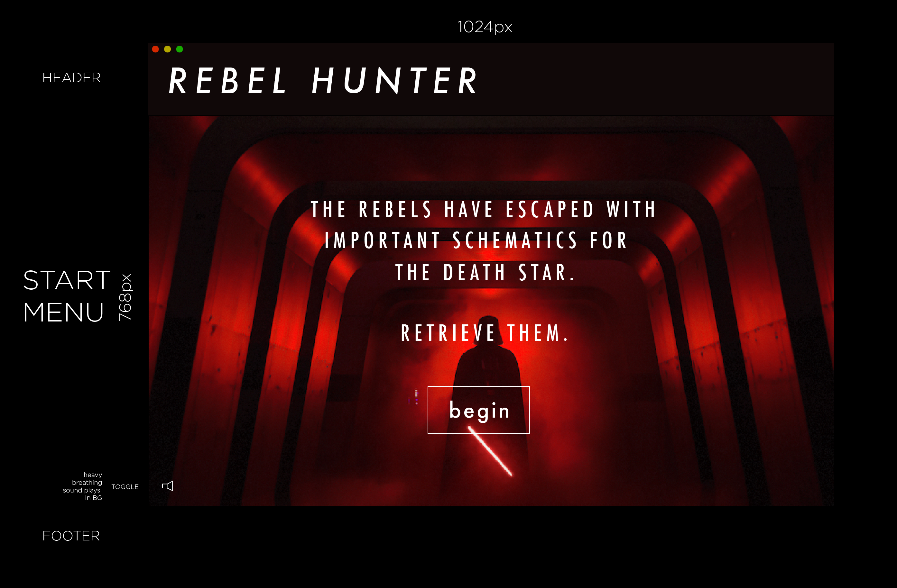
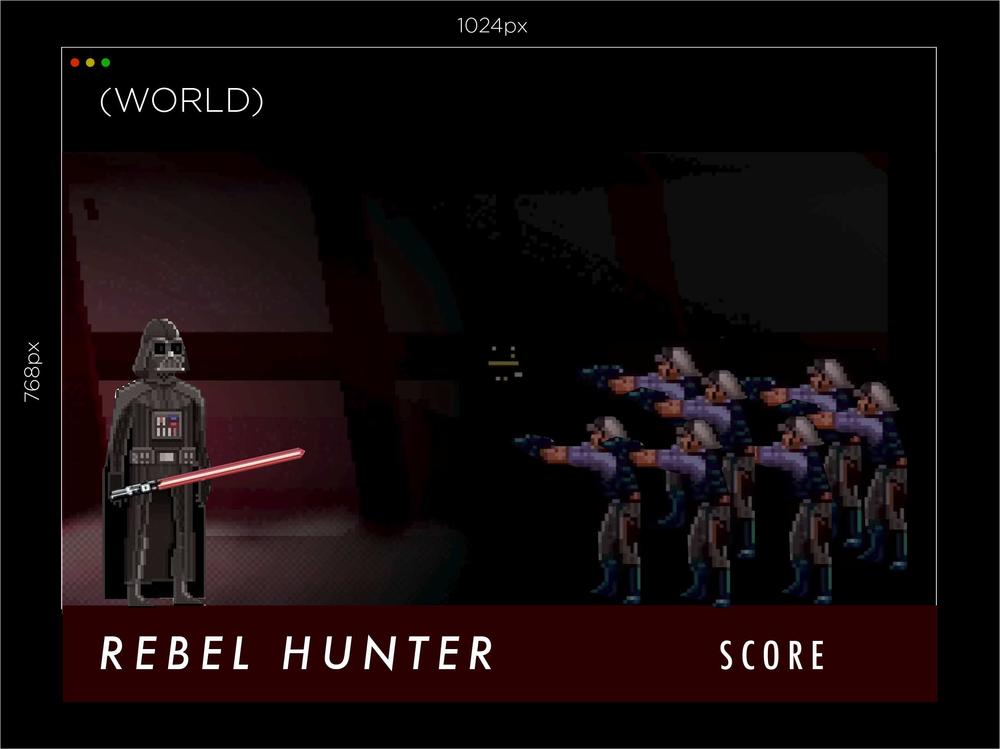
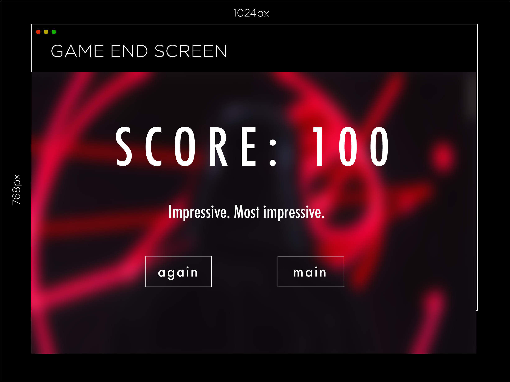

# Rebel-Hunter-v1
Darth Vader/Star Wars based mini-game using HTML/CSS/JQuery

*** Tom Santos / 7/11/17 ***

# Rebel Hunter Proposal

## What is Rebel Hunter?

In this side scroller, Darth Vader faces off against a series of rebel scum and blaster bolts. Using the lightsaber, incoming enemies must be destroyed with key "1". Blaster bolts should be deflected with key "Spacebar". Several new force powers may be unlocked if the player is particularly effective. 

## Wireframe

## Initial thoughts on game structure

- Challenges TBD

## Phases of Completion

Phase 0:
- Design HTML/CSS
- Get/create game assets (characters, backgrounds, etc)

Phase 1:
- Build game logic
- Build JS/jQuery files

Phase 2:
- Create scoring mechanic
- Create/find some kind of collision mechanic

Phase 3:
- Test game

Phase 4:
- Feedback and loop

(The steps or phases you expect to go through, and the tasks that you'll need to accomplish to reach each step. These should resemble the acceptance criteria we were working through earlier.)

## Links and Resources
- Place where I can get access to algorithms, game art, etc.
